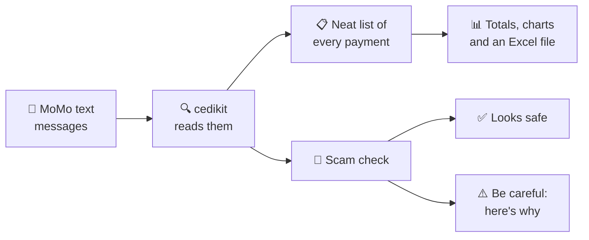
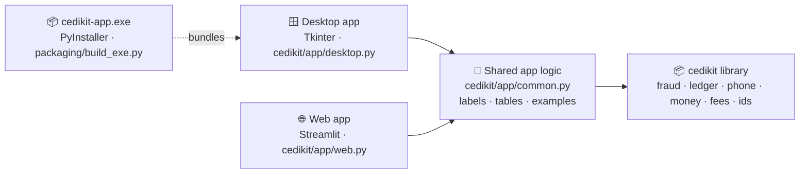
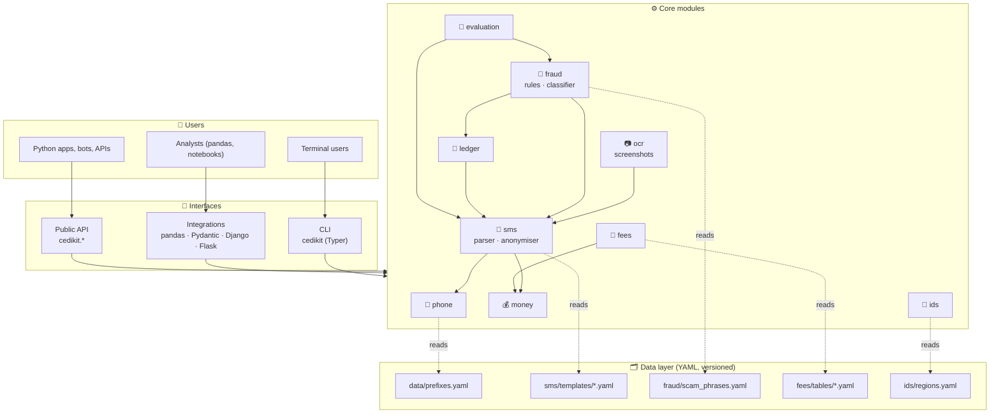
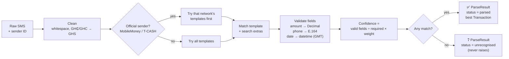
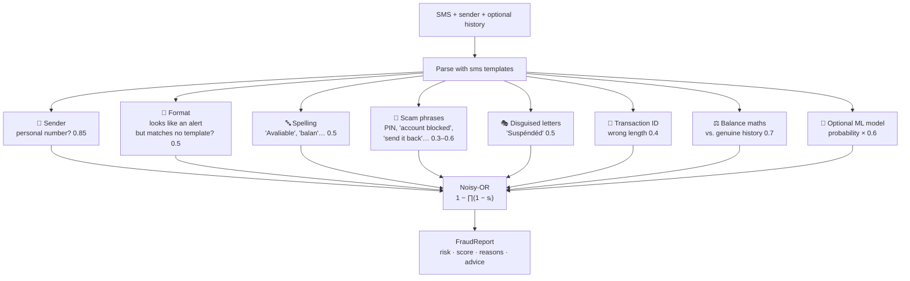
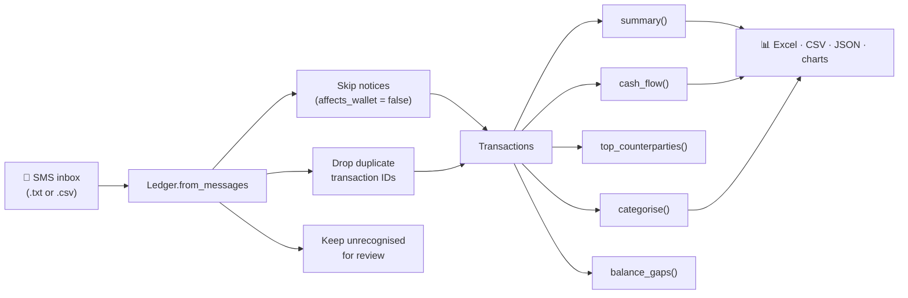
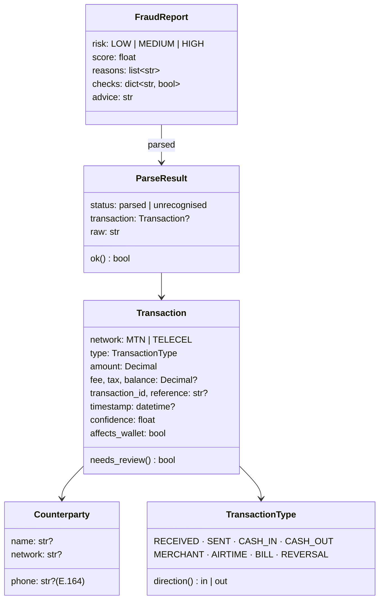

<div align="center">


### A Python toolkit for Ghanaian phone numbers, cedi amounts and Mobile Money transactions
#### 📦 Python library · 💻 Command line · 🪟 Desktop app · 🌐 Web app

[](https://pypi.org/project/cedikit/)
[](https://pypi.org/project/cedikit/)
[](https://cedikit.readthedocs.io/)
[](https://github.com/brainiacweb-tech/cedikit/blob/main/LICENSE)
<br>


[](https://github.com/brainiacweb-tech/cedikit/releases/latest)

**[📚 Documentation](https://cedikit.readthedocs.io/)** ·
**[🖥️ Apps](#%EF%B8%8F-desktop-and-web-apps)** ·
**[⬇️ Download for Windows](https://github.com/brainiacweb-tech/cedikit/releases/latest)** ·
**[🚀 Quickstart](#-quickstart)** ·
**[🏗️ Architecture](#%EF%B8%8F-architecture)** ·
**[💻 CLI](#-command-line)** ·
**[🤝 Contributing](#-contributing)**

</div>

---

> [!TIP]
> **Not a programmer? You don't need to write any code.** cedikit also comes as a normal
> **Windows program**: [download `cedikit-app.exe`](https://github.com/brainiacweb-tech/cedikit/releases/latest),
> double-click it, and use the buttons to check payment messages (or **screenshots** of them)
> for scams, turn your MoMo
> messages into an Excel account book, and clean up customers' phone numbers.
> [See the apps ↓](#%EF%B8%8F-desktop-and-web-apps)

<div align="center">

<br><sub>The cedikit desktop app flagging a fake MoMo payment message</sub>
</div>

---

## 📖 Table of contents

- [cedikit in plain words](#-cedikit-in-plain-words) ← start here if you're not a programmer
- [Desktop and web apps](#%EF%B8%8F-desktop-and-web-apps) ← use cedikit without writing code
  - [Feature tour: try these tests yourself](#-feature-tour-try-these-tests-yourself) ← see every feature working
- [Why cedikit?](#-why-cedikit)
- [Features](#-features)
- [Installation](#-installation)
- [Quickstart](#-quickstart)
- [Command line](#-command-line)
- [Architecture](#%EF%B8%8F-architecture)
- [How it works](#%EF%B8%8F-how-it-works)
- [Project structure](#-project-structure)
- [Data model](#-data-model)
- [Design principles](#-design-principles)
- [Quality and testing](#-quality-and-testing)
- [Privacy and ethics](#-privacy-and-ethics)
- [Limitations](#%EF%B8%8F-limitations)
- [Roadmap](#%EF%B8%8F-roadmap)
- [Contributing](#-contributing)
- [Licence and acknowledgements](#-licence-and-acknowledgements)

---

## 🧒 cedikit in plain words

*No computer knowledge needed for this part.*

### 🛒 Meet Auntie Akosua

Auntie Akosua sells provisions in Kumasi. Most of her customers pay with **Mobile Money
(MoMo)**. Every time someone pays, her phone gets a text message like this:

> *Payment received for GHS 50.00 from KOFI MENSAH. Current Balance: GHS 320.00 ...*

By the end of the month she has **hundreds** of these messages, and four problems:

1. 😵 **She can't see the big picture.** How much did she make this week? Who are her best
   customers? The answers are buried in hundreds of texts.
2. 📓 **Her records are messy.** Customers' phone numbers are written in many different ways
   (`024 412 3456`, `+233244123456`, `244123456`…), so the same person looks like three people.
3. 🧮 **Small mistakes add up.** Computers are surprisingly bad at adding money with pesewas:
   ask one to add GHS 0.10 and GHS 0.20 and you can get GHS 0.30000000000000004. Over thousands
   of sales, the totals drift.
4. 🦹 **Tricksters send fake messages.** A thief shows her a text that *looks* like a real
   payment, takes the goods, and walks away. She was never paid.

**cedikit is a set of careful helpers that fixes all four.**

### 🧰 The helpers inside cedikit

| Helper | It works like… | What it does for Auntie Akosua |
|---|---|---|
| 📱 **Number tidier** | a teacher who makes everyone write their name the same way | Rewrites every phone number in one standard form, and says which network it most likely belongs to (MTN, Telecel or AT) |
| 💰 **Money counter** | a shopkeeper who never loses a single pesewa | Adds, rounds and writes money exactly, even in words: *"Forty-five Ghana cedis and fifty pesewas"* |
| 📩 **Message reader** | a secretary who reads every MoMo text for you | Picks out who paid, how much, when, the fee and the new balance, and writes it down neatly |
| 📷 **Screenshot reader** | someone reading a letter out loud to you | Reads the message straight off a **screenshot**, so you don't have to type or copy anything |
| 📒 **Account book** | an accountant | Adds everything up: money in, money out, fees, best customers, weekly totals. Then makes an **Excel file** and **charts** |
| 🚨 **Scam detector** | a wise security guard | Looks at a payment message and says **"looks safe" ✅** or **"be careful" ⚠️**, and explains *why* |
| 🧾 **Fee calculator** | a friend who knows the price list | Estimates how much the network will charge for sending or withdrawing money |
| 🪪 **ID checker** | someone checking a form is filled in correctly | Checks that a Ghana Card number or GhanaPost digital address is *written* correctly |

### 🔄 What happens, step by step



1. **You give cedikit the messages**: copy them from the phone, **take a screenshot**, or an
   app does it for you.
2. **It reads each one** and turns it into a neat line: *"50 cedis, from Kofi Mensah,
   Monday 10:15am, balance 320 cedis."*
3. **It adds everything up** into a monthly summary, just like an accountant's report.
4. **It checks suspicious messages** for signs of a trick.

### 🕵️ How the scam detector thinks

It works like a detective looking for **clues**. One clue might be an accident; several clues
together mean real danger.

| 🔎 Clue | Why it matters |
|---|---|
| **Who sent it?** | Real MoMo alerts come from **"MobileMoney"** or **"T-CASH"**. A message from an ordinary phone number like `055 123 4567` is almost always fake. |
| **Does it look exactly like a real alert?** | Fakes copy the wording but get it slightly wrong, e.g. *"Cash In for"* instead of *"Cash In received for"*. |
| **Spelling mistakes?** | Real alerts are written by a computer and never have typos. *"Avaliable balan"* is a giveaway. |
| **Scary or pushy words?** | *"Your account is blocked, don't try your PIN"* or *"I sent it by mistake, send it back"* are classic tricks. |
| **Disguised letters?** | Tricksters write *"Suspéndéd"* with strange accents to sneak past phone spam filters. |
| **Does the maths work?** | If yesterday's balance was 100 cedis and you "received" 50, today's balance must be 150. If the message says 700, something is wrong. |

The more clues it finds, the louder the alarm: **LOW** 🟢, **MEDIUM** 🟡 or **HIGH** 🔴.
It always explains which clues it found.

> [!IMPORTANT]
> **cedikit is a helper, not a bank.** Even when it says "looks safe", always check your
> balance in the official MoMo app or by dialling your network's official code **before
> handing over goods**.

### 🔒 Is my information safe?

Yes. cedikit works **entirely on your own computer or phone app**. It never sends your messages,
numbers or money details anywhere on the internet.

### 👥 Who is it for?

- 🏪 **Shop owners** can use the **desktop app** directly: no coding, just buttons
  ([see below](#%EF%B8%8F-desktop-and-web-apps)).
- 👩‍💻 **Programmers** use it like **ready-made building blocks** to build apps for Ghanaian
  businesses, so they don't have to build these helpers from scratch.
- 🏪 **Traders** also benefit through apps other people build on cedikit: cleaner records,
  automatic accounts and scam warnings.
- 🎓 **Students and researchers** use it to study Mobile Money data.

### 📚 Words you might see

| Word | Meaning |
|---|---|
| **Mobile Money (MoMo)** | Sending and receiving money using a phone, e.g. MTN MoMo or Telecel Cash |
| **SMS** | A text message |
| **Library** | A box of ready-made tools that programmers put inside their own apps |
| **Python** | A popular programming language; cedikit is written in it |
| **Open source** | The code is free for anyone to see, use and improve |
| **PyPI** | The online "app store" for Python tools; cedikit lives there |
| **Offline** | Works without the internet |

---

## 🖥️ Desktop and web apps

*Since version 1.1.0 (on PyPI from 1.2.0).* cedikit also comes as **software with windows and buttons**, so anyone can use
it without writing code. Both apps have the same six tabs and give exactly the same answers.

| Tab | What you do |
|---|---|
| ⚠️ **Check a message** | Paste a payment SMS **or open a screenshot of it** → **LOW / MEDIUM / HIGH** risk, with reasons |
| 📒 **Account book** | Paste MoMo messages, open a file **or open screenshots** → totals, a table of every payment, **Save as Excel** |
| 📱 **Phone numbers** | Paste a list or open a customer CSV → cleaned numbers, networks, bad numbers flagged |
| 💰 **Money & fees** | Amounts in words; estimate MoMo charges |
| 🪪 **Ghana Card & address** | Check a Ghana Card number or GhanaPostGPS address is written correctly |
| 📘 **About** | What cedikit does, and the safety reminder |

Every tab has a **"Try with samples"** button, so you can see it working straight away.

### 📷 Just take a screenshot

Most people have the message as a **screenshot**, not as text. Open the screenshot and cedikit
**reads the message off the picture**, **fills in who sent it** (from the name or number at the
top of the chat), and checks it. If the picture shows several messages, pick the one you want.
The *Account book* tab can read many screenshots at once.

<div align="center">

<br><sub>A screenshot read: two messages found, sender filled in automatically, verdict shown</sub>
</div>

Reading pictures happens **on your own computer** (Windows' built-in text recognition, or
RapidOCR on Mac and Linux). Nothing is uploaded. It's good but not perfect, so always compare
the text with your screenshot.

### 🧭 Feature tour: try these tests yourself

Every test below uses made-up data and works offline. Click a feature to open it. The same
results are checked automatically by cedikit's test suite (`tests/test_app.py`) and by the
app's built-in self-test (`cedikit-app --selftest`), so this tour stays accurate.

<details open>
<summary><b>⚠️ Spot a fake payment alert</b></summary>

**Try this**

1. Open the **Check a message** tab.
2. In **Try an example...**, choose **Fake cash-in**. (It fills in the message and the sender `+233591234567`.)

**You'll see:** 🔴 **HIGH RISK: Very likely fake (score 0.96)**, because it came from a personal phone number, doesn't match any genuine MTN format, and has spelling mistakes (*Avaliable*, *balan*).


From the command line: `cedikit fraud check "Cash In  for GHS150.00 from ... Avaliable balan 640.35" --sender +233591234567`

</details>

<details>
<summary><b>🚫 Spot the 'your account is blocked' trick</b></summary>

**Try this**

1. In **Check a message**, choose the example **Fake 'account blocked'**.

**You'll see:** 🔴 **HIGH RISK (score 0.98)**: personal sender, it tells you what to do with your PIN, and it claims your account is blocked (so you won't check your real balance).


From the command line: `cedikit fraud check "SORRY YOU HAVE BEING BLOCKED ... DO NOT TRY YOUR PIN" --sender +233591234567`

</details>

<details>
<summary><b>✅ See a genuine alert pass</b></summary>

**Try this**

1. In **Check a message**, choose the example **Genuine MTN payment** (sender `MobileMoney`).

**You'll see:** 🟢 **LOW RISK: Looks safe (score 0.00)**, with no warning signs, plus the reminder to still confirm in your MoMo app.


From the command line: `cedikit fraud check "Payment received for GHS 50.00 from KOFI MENSAH ..." --sender MobileMoney`

</details>

<details>
<summary><b>📷 Check a screenshot instead of typing</b></summary>

**Try this**

1. In **Check a message**, click **Try a sample screenshot** (or **Open screenshot...** for your own).

**You'll see:** *Read 2 messages*, the sender **MobileMoney** filled in automatically from the top of the chat, the newest message checked (🟢 LOW), and a picker to check the other message.


From the command line: `python -c "from cedikit import ocr; print(ocr.read_screenshot('shot.png'))"`

</details>

<details>
<summary><b>📒 Turn MoMo messages into an account book</b></summary>

**Try this**

1. Open the **Account book** tab.
2. Click **Try with sample messages**.
3. Click **Save as Excel...** to get a workbook with Transactions, Summary, Cash flow and Categories sheets.

**You'll see:** **6 transactions**: money in **GH₵ 245.00**, money out **GH₵ 350.00**, fees **GH₵ 1.00**, last MTN balance **GH₵ 94.00**, and each payment categorised (sales, supplies, cash withdrawal, *loan repayment*).


From the command line: `cedikit sms parse inbox.txt --sender MobileMoney --export xlsx`

</details>

<details>
<summary><b>📱 Clean up customers' phone numbers</b></summary>

**Try this**

1. Open the **Phone numbers** tab and click **Try with samples** (or **Open CSV...** for your customer list).
2. Click **Save cleaned list...** to download the result.

**You'll see:** **7 numbers: 0 valid, 5 fixed, 2 invalid.** Every number is rewritten as `+233...` with its likely network (MTN, Telecel, AT). `12345` (too short) and `021 123 4567` (a landline) are shown in red with the reason.


From the command line: `cedikit phone clean customers.csv --column phone`

</details>

<details>
<summary><b>💰 Amounts in words and MoMo charges</b></summary>

**Try this**

1. Open **Money & fees**, type `1250.50` and click **Show**.
2. Under *Estimate MoMo charges*, keep **MTN**, **Cash out (withdraw)**, `500`, and click **Estimate**.

**You'll see:** **GH₵ 1,250.50** and *One thousand two hundred and fifty Ghana cedis and fifty pesewas*; then a fee of **GH₵ 5.00**, E-Levy **GH₵ 0.00**, and where those numbers come from.


From the command line: `cedikit money words 1250.50  ·  cedikit fees estimate MTN cash_out 500`

</details>

<details>
<summary><b>🪪 Check a Ghana Card number</b></summary>

**Try this**

1. Open **Ghana Card & address**, type `gha 123456789 0` (any spacing or case) and click **Check**.

**You'll see:** ✔ **GHA-123456789-0 is correctly written (citizen card)**, plus a masked copy for sharing: `GHA-12*****89-0`.


From the command line: `cedikit ids check "gha 123456789 0"`

</details>

<details>
<summary><b>🌍 Check a foreign national's Ghana Card</b></summary>

**Try this**

1. Type `FGN-987654321-5` and click **Check**.

**You'll see:** ✔ **FGN-987654321-5 is correctly written (foreign national card)**. Cards for non-citizens start with `FGN`.


From the command line: `cedikit ids check FGN-987654321-5`

</details>

<details>
<summary><b>📍 Check a GhanaPostGPS digital address</b></summary>

**Try this**

1. Type `ak0395028` and click **Check**.

**You'll see:** ✔ **AK-039-5028 is correctly written: Kumasi Metropolitan, Ashanti**, with the hyphens added and the district and region looked up.


From the command line: `cedikit ids check ak0395028`

</details>

<details>
<summary><b>❌ See what a wrong ID looks like</b></summary>

**Try this**

1. Type `GHA-12345-6` (too few digits) and click **Check**.

**You'll see:** ✖ **Not a correctly written Ghana Card number or GhanaPostGPS address**, with examples of the right format. (These are format checks only: they never confirm that a card or address really exists.)


From the command line: `cedikit ids check GHA-12345-6`

</details>

### 🪟 Desktop app

A normal Windows program. Pick one way to start it:

| How | Steps |
|---|---|
| **Stand-alone program** (no Python needed) | Download `cedikit-app.exe` from the [Releases page](https://github.com/brainiacweb-tech/cedikit/releases) and double-click it |
| **With Python** | `pip install "cedikit[app]"`, then run `cedikit app` (or `cedikit-app`) |

> [!NOTE]
> Windows may warn about a program "from an unknown publisher" the first time, because the
> `.exe` isn't code-signed. Click **More info → Run anyway**, but only for a file you
> downloaded from the official Releases page.

### 🌐 Web app

The same tabs in your web browser:

```bash
pip install "cedikit[web]"
cedikit web                  # opens http://localhost:8501
```

It runs **only on your own computer** (`localhost`). The launcher also switches off Streamlit's
anonymous usage statistics, so nothing is sent online.

### 🧑‍💻 How the apps are built



Both apps only handle screens and buttons. All the logic lives in the library and in
`cedikit/app/common.py`, which is why they always agree. The `.exe` bundles Python, the desktop
app and cedikit's data files into one 14 MB program; build it with
`python packaging/build_exe.py`, which also self-tests the result.

---

## 💡 Why cedikit?

Mobile Money is central to everyday commerce in Ghana, yet every developer building a local
product ends up solving the same five problems again:

| # | Problem | What goes wrong | cedikit's answer |
|:-:|---|---|---|
| 1 | 📱 **Messy phone numbers** | `0244123456`, `+233 24 412 3456`, `233244123456`, `24 412 3456`… each app writes its own buggy cleaner | One normaliser for every common format, with reasons for rejections |
| 2 | 💸 **Unsafe money handling** | Floats turn `0.1 + 0.2` into `0.30000000000000004` | `Decimal` everywhere; floats are refused |
| 3 | 📩 **Unstructured MoMo records** | Small businesses keep their books in free-text SMS | Parser turns SMS into structured transactions and ledgers |
| 4 | 🚨 **Fake payment alerts** | Traders release goods on a fake "you have received GHS X" message | Explained fraud checks: sender, wording, balance maths and more |
| 5 | 🌍 **No Ghana-focused toolkit** | Global libraries know nothing about MoMo, cedis or local scams | Built from real (anonymised) Ghanaian messages |

---

## ✨ Features

<table>
<tr>
<td width="50%" valign="top">

### 📱 `phone`
Normalise, validate, format and mask Ghanaian mobile numbers; guess the network
(honestly labelled *likely*, because numbers can be ported); bulk-clean a whole column.

### 💰 `money`
Exact `Decimal` parsing of `"GH₵1.2k"`, `"50p"`, `"(GHS 5.00)"`; formatting
(`GH₵ 1,200.50`, `GH₵ 1.2k`); amounts in words; pesewa rounding; a float-proof `Cedi` type.

### 📩 `sms`
Parses **MTN MoMo** and **Telecel Cash** SMS into typed transactions with a
confidence score, from **12 templates** built from real messages. Includes an
**anonymiser** that keeps balances consistent, and 📷 **`ocr`**: read messages (and the sender)
straight from **screenshots**, offline.

### 🚨 `fraud`
Rates a payment SMS **LOW / MEDIUM / HIGH** and explains why: personal-number
senders, wording that doesn't match genuine alerts, typos, scam phrases, disguised
letters, impossible balances, plus an optional ML model.

</td>
<td width="50%" valign="top">

### 📒 `ledger`
Summaries, cash flow by day/week/month, top counterparties, rule-based categories
(loan repayments detected), **balance-gap detection**, and export to **Excel / CSV / JSON**
with charts.

### 🧾 `fees`
Fee and **E-Levy** estimates from dated tables in which every rule cites its evidence.
Unknown charges are reported as unknown, never guessed.

### 🪪 `ids`
**Ghana Card** (`GHA` citizens / `FGN` foreign nationals) and **GhanaPostGPS**
format checks, with region and district names for **218 district codes**.

### 🔌 Integrations and tools
🪟 **Desktop app** and 🌐 **web app** for non-programmers · `cedikit` **CLI** · **pandas** `.cedikit` accessor · **Pydantic** field types ·
**Django** and **Flask/WTForms** validators · evaluation tools for precision and recall.

</td>
</tr>
</table>

---

## 📦 Installation

**Pick what suits you:**

| I am… | Get this | How |
|---|---|---|
| 🏪 **Not a programmer** | 🪟 Desktop app | [Download `cedikit-app.exe`](https://github.com/brainiacweb-tech/cedikit/releases/latest) and double-click it. No Python needed. |
| 🙋 **Comfortable with Python** | 🪟 Desktop or 🌐 web app | `pip install "cedikit[app]"` → `cedikit app`, or `pip install "cedikit[web]"` → `cedikit web` |
| 👩‍💻 **A developer** | 📦 Library + 💻 CLI | `pip install cedikit` (below) |

```bash
pip install cedikit             # core library + the `cedikit` command
pip install "cedikit[all]"      # + every optional extra below
```

Requires **Python 3.10+**. The core depends only on `PyYAML` and `Typer`.

| Extra | Adds | Enables |
|---|---|---|
| `excel` | openpyxl | `ledger.export("file.xlsx")` |
| `charts` | matplotlib | `ledger.plot()` |
| `pandas` | pandas | `df["phone"].cedikit.normalise()`, `ledger.to_dataframe()` |
| `ml` | scikit-learn, joblib | `fraud.classifier.ScamClassifier` |
| `pydantic` | pydantic | `GhanaPhone`, `CediAmount` field types |
| `django` · `flask` | django · wtforms | Form and model validators |
| `ocr` | Pillow + Windows OCR / RapidOCR | `ocr.read_screenshot("shot.png")`: messages from screenshots |
| `app` | openpyxl, ocr | The desktop app with Excel export and screenshots (`cedikit app`) |
| `web` | streamlit, openpyxl, ocr | The web app (`cedikit web`) |

> [!TIP]
> On Windows, if `cedikit` isn't recognised after installing, pip has put it in a folder that
> isn't on your `PATH`. Install inside a virtual environment, or add the folder pip prints to
> `PATH` and open a new terminal.

---

## 🚀 Quickstart

### 📱 Phone numbers

```python
from cedikit import phone

phone.normalise("024 412 3456")  # '+233244123456'
phone.format("+233244123456", "pretty")  # '024 412 3456'
phone.likely_network("0244123456").network  # 'MTN' (likely - numbers can be ported)
phone.mask("0244123456")  # '024****456'

report = phone.clean_column(["0244123456", "+233 50 123 4567", "12345"])
print(report)  # 3 numbers: 0 valid, 2 fixed, 1 invalid
```

### 💰 Money

```python
from cedikit import money, Cedi

money.parse("GH₵1.2k")  # Decimal('1200.00')
money.format("1200.5")  # 'GH₵ 1,200.50'
money.to_words("1200.50")  # 'One thousand two hundred Ghana cedis and fifty pesewas'
sum([Cedi("0.10"), Cedi("0.20")])  # Cedi('0.30')  - exact, unlike 0.1 + 0.2
money.format(1200.5)  # CediTypeError: floats can't represent pesewas exactly
```

### 📩 SMS → 📒 ledger

```python
from cedikit import sms
from cedikit.ledger import Ledger

result = sms.parse(message_text, sender="MobileMoney")
if result.ok:
    tx = result.transaction
    print(tx.type, tx.amount, tx.counterparty.name, tx.balance, tx.confidence)

ledger = Ledger.from_messages(inbox, sender="MobileMoney").categorise()
print(ledger.summary())
ledger.cash_flow("week")  # money in / out per week
ledger.top_counterparties(5, by="value")  # biggest customers and suppliers
ledger.balance_gaps()  # where a message is probably missing
ledger.export("september.xlsx")  # Transactions, Summary, Cash flow, Categories
```

### 🚨 Fake-alert check

```python
from cedikit import fraud

report = fraud.check(suspicious_text, sender="+233591234567", history=ledger.transactions)
print(report)
```

```text
Risk: HIGH (score 0.99)
Reasons:
  - Sent from a personal phone number (+233 59 123 4567), not an official sender ID such as
    MobileMoney or T-CASH. Genuine alerts never come from personal numbers.
  - Claimed balance GHS 640.35 does not follow from your last genuine balance of GHS 322.10
    (expected GHS 472.10), unless you made other transactions in between.
  - Looks like a Mobile Money alert but does not match any genuine message format.
  - Contains spelling mistakes ('Avaliable', 'balan'). Genuine alerts are machine-generated
    and don't have typos.
Before releasing goods or cash, confirm the payment in your official Mobile Money app ...
```

### 📷 Screenshots

```python
from cedikit import ocr, fraud

shot = ocr.read_screenshot("whatsapp_image.jpg")  # needs: pip install "cedikit[ocr]"
shot.sender  # 'MobileMoney' (read from the chat header)
for message in shot.messages:  # one entry per chat bubble
    print(fraud.check(message, sender=shot.sender).risk)
```

### 🧾 Fees and 🪪 IDs

```python
from datetime import date
from cedikit import fees
from cedikit.ids import ghana_card, gpgps

fees.estimate("MTN", "cash_out", "500").fee  # Decimal('5.00')
fees.estimate("MTN", "send_other_network", "4000", date(2024, 5, 26)).tax
# Decimal('40.00') - the 1% E-Levy then

ghana_card.card_type("FGN-123456789-0")  # 'foreign national'
gpgps.parse("ak0395028").district  # 'Kumasi Metropolitan'
```

---

## 💻 Command line

Installing cedikit adds a `cedikit` command:

```bash
cedikit phone clean customers.csv --column phone        # clean a CSV column
cedikit sms parse inbox.csv --export xlsx               # SMS → Excel ledger
cedikit fraud check "Cash receive for 200.00 ..." --sender 0551234567
cedikit fees estimate TELECEL send_other_network 40
cedikit ids check AK-039-5028
```

| Command | Purpose |
|---|---|
| `phone clean` · `phone check` | Normalise a CSV column (adds status and reason columns) · inspect one number |
| `money parse` · `money words` | `GH₵1.2k` → `1200.00` · amount in words |
| `sms parse` · `sms anonymise` | Messages → ledger summary, balance gaps, export · anonymise before sharing |
| `fraud check` | Risk rating with reasons (`-` reads from stdin) |
| `fees estimate` | Fee and E-Levy estimate for a date |
| `ids check` | Ghana Card or GhanaPostGPS format check |

---

## 🏗️ Architecture

cedikit is a set of small, independent modules over a **data layer of YAML files**. Nothing
touches the network. Rules that change over time (prefixes, message formats, fees, scam
phrases, district codes) live in data, so they can be updated without code changes.



### Module dependencies

| Module | Depends on | Data it reads |
|---|---|---|
| `phone` | — | `data/prefixes.yaml` |
| `money` | — | — |
| `sms` | `phone`, `money` | `sms/templates/mtn.yaml`, `telecel.yaml` |
| `ledger` | `sms`, `money`, `phone` | — |
| `fraud` | `sms`, `ledger`, `phone`, `money` | `fraud/scam_phrases.yaml` |
| `fees` | `money` | `fees/tables/*.yaml` |
| `ids` | — | `ids/regions.yaml` |
| `ocr` | `sms` (to recognise senders) | — (uses Windows OCR or RapidOCR) |
| `evaluation` | `sms`, `fraud` | your labelled YAML files |

---

## ⚙️ How it works

### 📩 SMS parsing pipeline

Each message format is a **template**: a regular expression written with readable
`{{placeholders}}`. When a telco changes its wording, a new template is added; the parser
code doesn't change.



A template looks like this (from [`sms/templates/mtn.yaml`](https://github.com/brainiacweb-tech/cedikit/blob/main/src/cedikit/sms/templates/mtn.yaml)):

```yaml
- name: mtn_cash_out
  type: CASH_OUT
  pattern: >-
    Cash Out made for {{amount}} to {{counterparty_name}} ?\.
    Current Balance:? {{balance}}
    Financial Transaction Id: {{transaction_id}}\.
    .*?Fee charged: {{fee}}
  fields:
    transaction_id: '\d{11}'
```

**Supported formats (12):**

| | Telecel Cash | MTN MoMo |
|---|---|---|
| 📤 Send | same network, other network | other network |
| 📥 Receive | same network, other network | payment received |
| 🛒 Pay | — | merchants, loans, auto-debits |
| 🏧 Cash in / out | cash in | cash in, cash out |
| 📶 Airtime / data | airtime purchase, airtime notice | data bundle |

### 🚨 Fraud scoring

Every check produces independent **signals** with a strength between 0 and 1. They are
combined with a **noisy-OR**, so separate red flags reinforce each other and passing checks
never water down a failing one:

$$\text{score} = 1 - \prod_{i}(1 - s_i) \qquad \text{LOW} < 0.35 \le \text{MEDIUM} \le 0.70 < \text{HIGH}$$



> [!NOTE]
> **Why not a weighted average?** A perfect copy of a genuine alert sent from a personal
> number passes every wording check. An average would dilute the one decisive signal to
> MEDIUM; noisy-OR keeps it HIGH.

### 📒 From SMS to insight



**`affects_wallet`:** some messages repeat a transaction without moving money. Telecel
sends "you have received airtime" after an airtime purchase, with the same transaction ID.
These are recognised but marked `affects_wallet=False`, so ledgers never count them twice.

**Balance gaps:** consecutive balances must satisfy
`new = previous ± amount − fee − tax`. When they don't, a message is usually missing, such
as an automatic loan deduction. Occasionally a message is fake.

---

## 📁 Project structure

```text
cedikit/
├── 📂 src/cedikit/
│   ├── __init__.py              # public API: phone, money, sms, fraud, ledger, fees, ids
│   ├── phone.py                 # 📱 normalise, validate, format, mask, clean_column
│   ├── money.py                 # 💰 Decimal parsing/formatting, to_words, Cedi type
│   ├── ledger.py                # 📒 Ledger, summaries, cash flow, exports, charts
│   ├── evaluation.py            # 📏 parser accuracy, fraud precision/recall
│   ├── ocr.py                   # 📷 read messages + sender from screenshots
│   ├── cli.py                   # 💻 the `cedikit` command (Typer)
│   ├── exceptions.py            # CedikitError and friends
│   ├── py.typed                 # ships type hints to users
│   ├── 📂 data/
│   │   └── prefixes.yaml        # network prefixes (NCA numbering plan + updates)
│   ├── 📂 sms/
│   │   ├── parser.py            # template engine, confidence scoring
│   │   ├── models.py            # Transaction, Counterparty, ParseResult
│   │   ├── anonymise.py         # privacy-preserving anonymiser
│   │   └── 📂 templates/        # mtn.yaml, telecel.yaml
│   ├── 📂 fraud/
│   │   ├── rules.py             # checks + noisy-OR scoring
│   │   ├── classifier.py        # optional scikit-learn model
│   │   └── scam_phrases.yaml    # scam language, misspellings, ID lengths
│   ├── 📂 fees/
│   │   ├── calculator.py        # dated, sourced fee + E-Levy estimates
│   │   └── 📂 tables/           # mtn.yaml, telecel.yaml, levies.yaml
│   ├── 📂 ids/
│   │   ├── ghana_card.py        # GHA / FGN card numbers
│   │   ├── gpgps.py             # GhanaPostGPS digital addresses
│   │   └── regions.yaml         # 10 region letters, 218 district codes
│   ├── 📂 integrations/          # pandas, pydantic, django, flask
│   └── 📂 app/                   # 🖥️ apps for non-programmers
│       ├── common.py            # shared labels, tables, examples
│       ├── desktop.py           # 🪟 Tkinter desktop app
│       ├── web.py               # 🌐 Streamlit web app
│       └── cedikit.ico          # app icon
├── 📂 tests/                    # 403 tests, anonymised fixtures in fixtures/sample_messages/
├── 📂 docs/                     # MkDocs site (Read the Docs)
├── 📂 examples/                 # synthetic demo data + generator
├── 📂 notebooks/                # end-to-end demo notebook
├── 📂 packaging/                # builds the stand-alone cedikit-app.exe
├── .github/workflows/ci.yml     # lint, types, tests on 3.10–3.13, build, publish
├── .readthedocs.yaml            # docs hosting
└── pyproject.toml               # packaging (Hatch), extras, tool config
```

---

## 🧬 Data model



---

## 🧭 Design principles

| | Principle | In practice |
|:-:|---|---|
| 🔒 | **Offline by default** | No network calls anywhere. No data leaves the device. |
| 🗂️ | **Data separate from code** | Prefixes, templates, fees, scam phrases and districts are YAML. |
| 🧩 | **Small, focused modules** | Use `phone` alone, or combine everything. |
| 🛟 | **Fail gracefully** | Unknown SMS returns `unrecognised`; invalid input explains *why*. |
| 🎯 | **Honest outputs** | Networks are *likely*, fees are *estimates*, fraud is a *risk indicator*, unknowns stay `None`. |
| 💯 | **Money is never a float** | `Decimal` end to end; floats raise `CediTypeError`. |
| 📜 | **Evidence over guesses** | Every fee rule and dataset cites its source; real messages beat unverified guides. |

---

## ✅ Quality and testing

| Check | Result |
|---|---|
| 🧪 Tests (pytest + Hypothesis property tests) | **403 passing** |
| 📈 Line coverage | **99%** (minimum enforced: 90%) |
| 🔍 Type checking | **mypy strict**, zero errors |
| 🧹 Lint and format | **Ruff**, zero issues |
| 📚 Docstring examples | 30 doctests run as tests |
| 📄 Docs build | `mkdocs build --strict` |
| 🐍 Python versions | 3.10 · 3.11 · 3.12 · 3.13 |

Property-based tests check invariants such as `normalise(format(x)) == x` for every valid
number, exact `Cedi` sums, and that the parser never raises on arbitrary text. Every
anonymised sample message must parse to its expected fields, and every genuine one must score
LOW for fraud.

```bash
git clone https://github.com/brainiacweb-tech/cedikit && cd cedikit
python -m venv .venv && .venv/Scripts/activate       # macOS/Linux: source .venv/bin/activate
pip install -e ".[dev,docs]"
pytest                                   # tests + coverage
pytest --no-cov --doctest-modules src    # docstring examples
ruff check . && ruff format --check .
mypy
mkdocs serve                             # docs at http://127.0.0.1:8000
```

---

## 🔐 Privacy and ethics

- 🔒 **Offline only.** Nothing is uploaded, logged or stored unless you export it. Even
  screenshots are read on your own computer.
- 🕶️ **Masking helpers:** `phone.mask()` and `ghana_card.mask()` for logs and reports.
- 🧹 **Anonymised data only.** Every sample message in this repository was anonymised
  before being committed. `cedikit sms anonymise` does it for you and keeps balances
  consistent.
- ⚠️ **Always confirm payments** in the official Mobile Money app or USSD menu before
  releasing goods. No SMS check is a guarantee.
- ⚖️ Designed in line with the principles of Ghana's **Data Protection Act, 2012 (Act 843)**.

---

## ⚠️ Limitations

- **Formats:** MTN MoMo and Telecel Cash only (12 templates). AT Money is out of scope.
- **Fees** are estimates. MTN's cross-network fee and Telecel's cash-out fee are unknown
  until confirmed from real messages or official tariffs.
- **Screenshots:** text recognition can misread characters; cedikit fixes common slips
  (`GHS50.OO` → `GHS50.00`) but the text should always be compared with the picture.
- **Ghana Card** check digits can't be verified; the algorithm isn't published.
- **ID checks** confirm format only, never that a card or address exists.
- **Fraud accuracy** has so far been measured on the messages used to write the rules; a
  held-out evaluation is in progress. No trained ML model is shipped.

---

## 🗺️ Roadmap

- [x] 📱 Phone, 💰 money, 📩 SMS parser, 🚨 fraud checks, 📒 ledger, 🧾 fees, 🪪 IDs
- [x] 💻 CLI, 🔌 integrations, 📚 docs, 📦 PyPI release
- [ ] 📏 Held-out evaluation on unseen genuine and scam messages
- [x] 🖥️ Desktop app, stand-alone `.exe`, web app, `python -m cedikit`
- [ ] 🏦 Bank transaction SMS · 📄 MoMo PDF statements
- [ ] 🗣️ Twi and other local-language scam phrases
- [ ] 🤖 Telegram bot and web app built on cedikit
- [ ] 🌍 Country packs for Nigeria and Côte d'Ivoire

---

## 🤝 Contributing

Contributions are welcome, especially **new SMS templates** when a telco changes its wording
and **anonymised scam samples**.

1. Read [CONTRIBUTING.md](https://github.com/brainiacweb-tech/cedikit/blob/main/CONTRIBUTING.md)
   and [Adding an SMS template](https://github.com/brainiacweb-tech/cedikit/blob/main/docs/contributing-templates.md).
2. **Never commit real personal data.** Run `cedikit sms anonymise` first.
3. Make sure `pytest`, `ruff` and `mypy` pass.

Found a bug or a message that doesn't parse?
[Open an issue](https://github.com/brainiacweb-tech/cedikit/issues) with an **anonymised** copy.

---

## 📜 Licence and acknowledgements

Released under the **[MIT Licence](https://github.com/brainiacweb-tech/cedikit/blob/main/LICENSE)** © Francis Kusi.

Built by **Francis Kusi** as a BSc Business Information Technology project,
Department of Supply Chain and Information Systems, **KNUST School of Business**.

Data sources: National Communications Authority numbering plan, GhanaPostGPS, Ghana Revenue
Authority, and anonymised messages generously shared by volunteers.

<div align="center">

**🇬🇭 Built in Ghana, for Ghana.**

</div>
