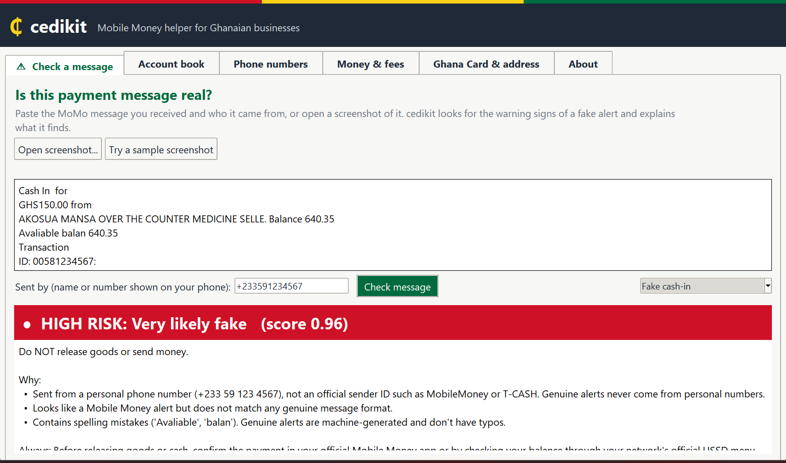
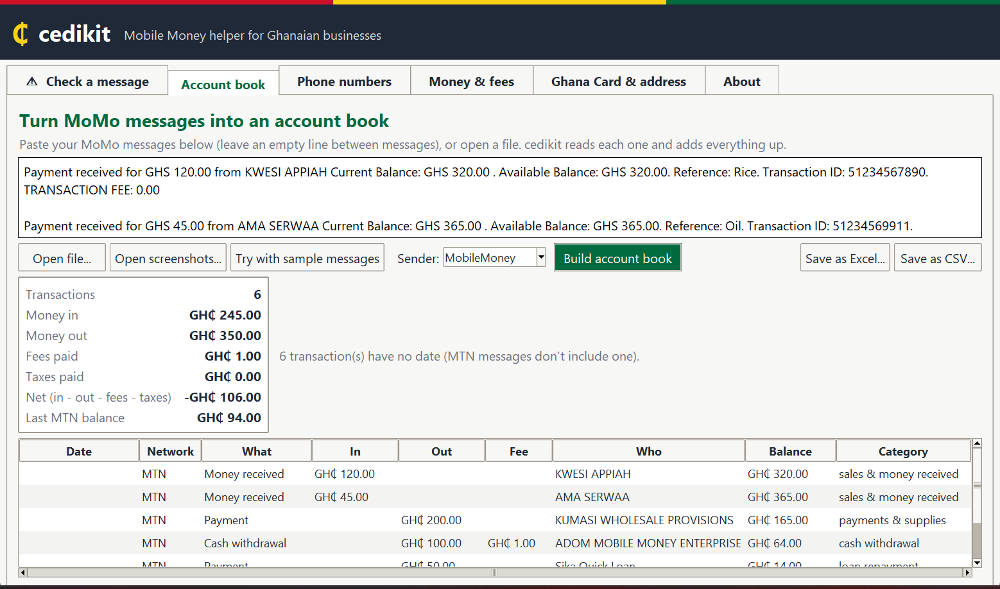
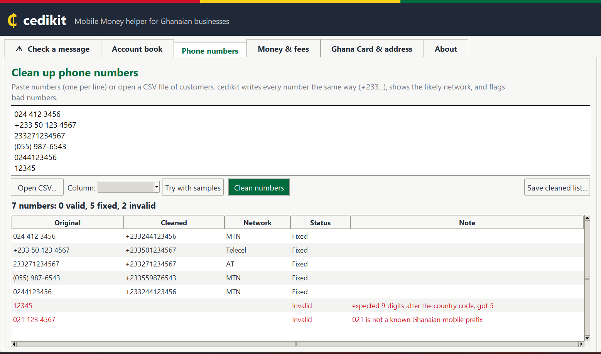
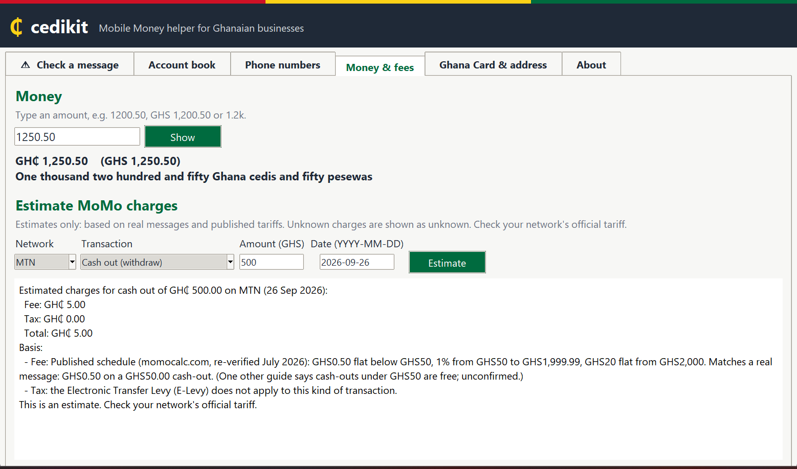
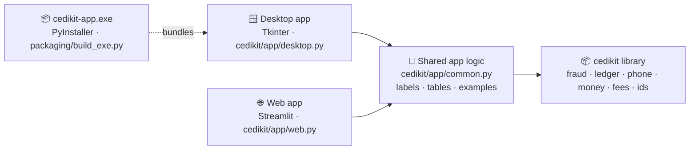

# 🖥️ Desktop and web apps

*New in version 1.1.0.* cedikit also comes as **software with windows and buttons**, so anyone can use
it without writing code. Both apps have the same six tabs and give exactly the same answers.

| Tab | What you do |
|---|---|
| ⚠️ **Check a message** | Paste a payment SMS **or open a screenshot of it** → **LOW / MEDIUM / HIGH** risk, with reasons |
| 📒 **Account book** | Paste MoMo messages, open a file **or open screenshots** → totals, a table of every payment, **Save as Excel** |
| 📱 **Phone numbers** | Paste a list or open a customer CSV → cleaned numbers, networks, bad numbers flagged |
| 💰 **Money & fees** | Amounts in words; estimate MoMo charges |
| 🪪 **Ghana Card & address** | Check a Ghana Card number or GhanaPostGPS address is written correctly |
| 📘 **About** | What cedikit does, and the safety reminder |

Every tab has a **"Try with samples"** button, so you can see it working straight away.

## 📷 Just take a screenshot

Most people have the message as a **screenshot**, not as text. Open the screenshot and cedikit
**reads the message off the picture**, **fills in who sent it** (from the name or number at the
top of the chat), and checks it. If the picture shows several messages, pick the one you want.
The *Account book* tab can read many screenshots at once.

<div align="center">

<br><sub>A screenshot read: two messages found, sender filled in automatically, verdict shown</sub>
</div>

Reading pictures happens **on your own computer** (Windows' built-in text recognition, or
RapidOCR on Mac and Linux). Nothing is uploaded. It's good but not perfect, so always compare
the text with your screenshot.

<table>
<tr>
<td width="50%"><br><sub><b>Check a message:</b> a fake alert flagged HIGH risk, with the reasons</sub></td>
<td width="50%"><br><sub><b>Account book:</b> MoMo messages turned into totals and a table, ready for Excel</sub></td>
</tr>
<tr>
<td width="50%"><br><sub><b>Phone numbers:</b> every number written the same way; bad ones in red</sub></td>
<td width="50%"><br><sub><b>Money & fees:</b> amounts in words, and fee estimates with their sources</sub></td>
</tr>
</table>

## 🪟 Desktop app

A normal Windows program. Pick one way to start it:

| How | Steps |
|---|---|
| **Stand-alone program** (no Python needed) | Download `cedikit-app.exe` from the [Releases page](https://github.com/brainiacweb-tech/cedikit/releases) and double-click it |
| **With Python** | `pip install "cedikit[app]"`, then run `cedikit app` (or `cedikit-app`) |

!!! note "Windows SmartScreen"
    Windows may warn about a program "from an unknown publisher" the first time, because the
    `.exe` isn't code-signed. Click **More info → Run anyway**, but only for a file you
    downloaded from the official Releases page.

## 🌐 Web app

The same tabs in your web browser:

```bash
pip install "cedikit[web]"
cedikit web                  # opens http://localhost:8501
```

It runs **only on your own computer** (`localhost`). The launcher also switches off Streamlit's
anonymous usage statistics, so nothing is sent online.

## 🧑‍💻 How the apps are built



Both apps only handle screens and buttons. All the logic lives in the library and in
`cedikit/app/common.py`, which is why they always agree. The `.exe` bundles Python, the desktop
app and cedikit's data files into one 14 MB program; build it with
`python packaging/build_exe.py`, which also self-tests the result.
