# 🖥️ Desktop and web apps

*New in version 1.1.0.* cedikit also comes as **software with windows and buttons**, so anyone can use
it without writing code. Both apps have the same six tabs and give exactly the same answers.

| Tab | What you do |
|---|---|
| ⚠️ **Check a message** | Paste a payment SMS **or open a screenshot of it** → **LOW / MEDIUM / HIGH** risk, with reasons |
| 📒 **Account book** | Paste MoMo messages, open a file **or open screenshots** → totals, a table of every payment, **Save as Excel** |
| 📱 **Phone numbers** | Paste a list or open a customer CSV → cleaned numbers, networks, bad numbers flagged |
| 💰 **Money & fees** | Amounts in words; estimate MoMo charges |
| 🪪 **Ghana Card & address** | Check a Ghana Card number or GhanaPostGPS address is written correctly |
| 📘 **About** | What cedikit does, and the safety reminder |

Every tab has a **"Try with samples"** button, so you can see it working straight away.

## 📷 Just take a screenshot

Most people have the message as a **screenshot**, not as text. Open the screenshot and cedikit
**reads the message off the picture**, **fills in who sent it** (from the name or number at the
top of the chat), and checks it. If the picture shows several messages, pick the one you want.
The *Account book* tab can read many screenshots at once.

<div align="center">
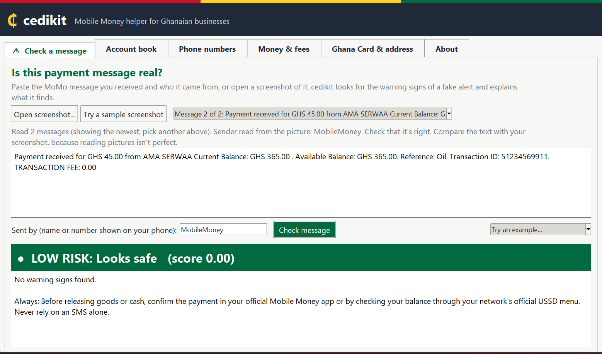
<br><sub>A screenshot read: two messages found, sender filled in automatically, verdict shown</sub>
</div>

Reading pictures happens **on your own computer** (Windows' built-in text recognition, or
RapidOCR on Mac and Linux). Nothing is uploaded. It's good but not perfect, so always compare
the text with your screenshot.

## 🧭 Feature tour: try these tests yourself

Every test below uses made-up data and works offline. The same
results are checked automatically by cedikit's test suite (`tests/test_app.py`) and by the
app's built-in self-test (`cedikit-app --selftest`), so this tour stays accurate.

### ⚠️ Spot a fake payment alert

**Try this**

1. Open the **Check a message** tab.
2. In **Try an example...**, choose **Fake cash-in**. (It fills in the message and the sender `+233591234567`.)

**You'll see:** 🔴 **HIGH RISK: Very likely fake (score 0.96)**, because it came from a personal phone number, doesn't match any genuine MTN format, and has spelling mistakes (*Avaliable*, *balan*).

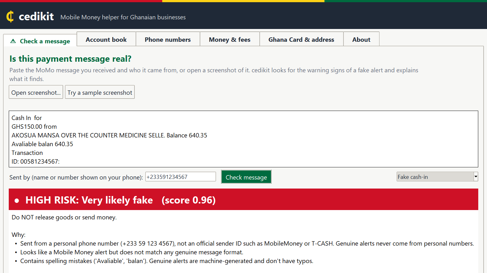

From the command line: `cedikit fraud check "Cash In  for GHS150.00 from ... Avaliable balan 640.35" --sender +233591234567`


### 🚫 Spot the 'your account is blocked' trick

**Try this**

1. In **Check a message**, choose the example **Fake 'account blocked'**.

**You'll see:** 🔴 **HIGH RISK (score 0.98)**: personal sender, it tells you what to do with your PIN, and it claims your account is blocked (so you won't check your real balance).

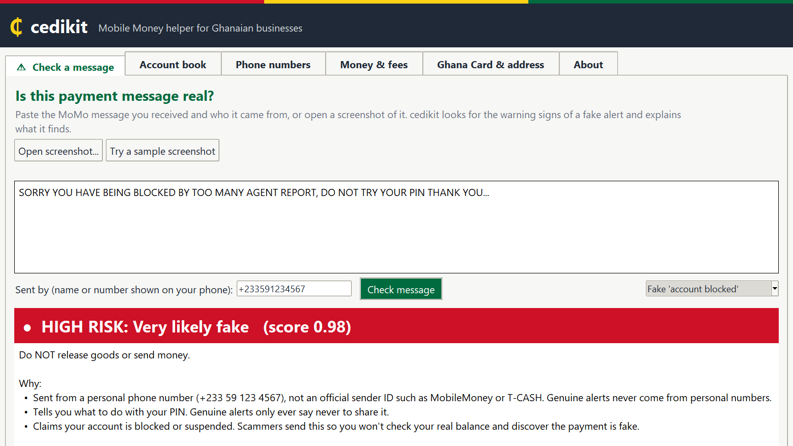

From the command line: `cedikit fraud check "SORRY YOU HAVE BEING BLOCKED ... DO NOT TRY YOUR PIN" --sender +233591234567`


### ✅ See a genuine alert pass

**Try this**

1. In **Check a message**, choose the example **Genuine MTN payment** (sender `MobileMoney`).

**You'll see:** 🟢 **LOW RISK: Looks safe (score 0.00)**, with no warning signs, plus the reminder to still confirm in your MoMo app.

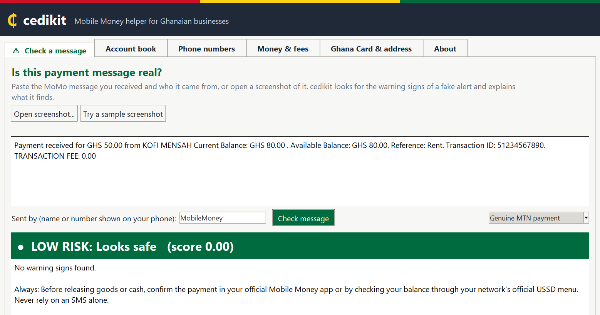

From the command line: `cedikit fraud check "Payment received for GHS 50.00 from KOFI MENSAH ..." --sender MobileMoney`


### 📷 Check a screenshot instead of typing

**Try this**

1. In **Check a message**, click **Try a sample screenshot** (or **Open screenshot...** for your own).

**You'll see:** *Read 2 messages*, the sender **MobileMoney** filled in automatically from the top of the chat, the newest message checked (🟢 LOW), and a picker to check the other message.

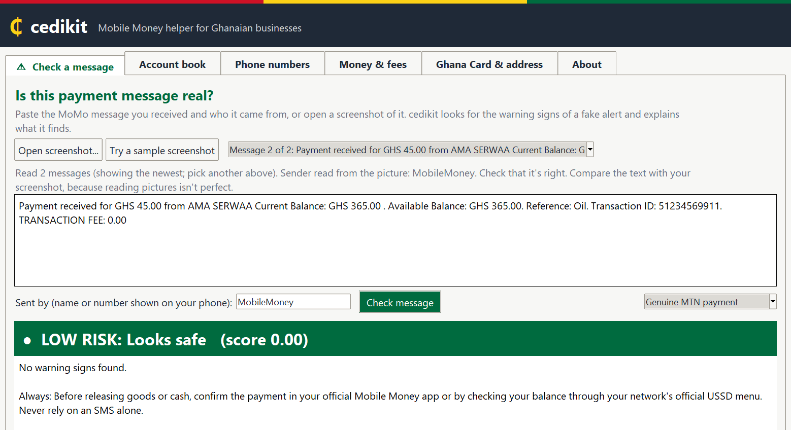

From the command line: `python -c "from cedikit import ocr; print(ocr.read_screenshot('shot.png'))"`


### 📒 Turn MoMo messages into an account book

**Try this**

1. Open the **Account book** tab.
2. Click **Try with sample messages**.
3. Click **Save as Excel...** to get a workbook with Transactions, Summary, Cash flow and Categories sheets.

**You'll see:** **6 transactions**: money in **GH₵ 245.00**, money out **GH₵ 350.00**, fees **GH₵ 1.00**, last MTN balance **GH₵ 94.00**, and each payment categorised (sales, supplies, cash withdrawal, *loan repayment*).

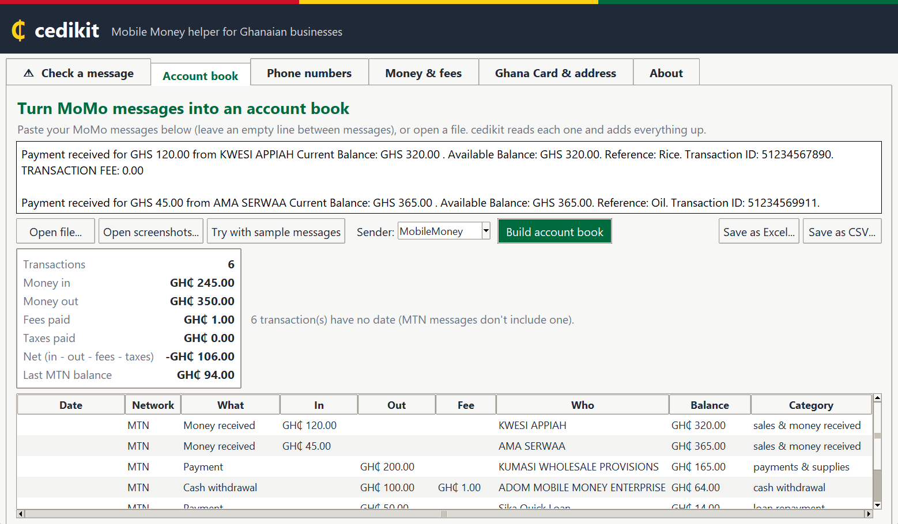

From the command line: `cedikit sms parse inbox.txt --sender MobileMoney --export xlsx`


### 📱 Clean up customers' phone numbers

**Try this**

1. Open the **Phone numbers** tab and click **Try with samples** (or **Open CSV...** for your customer list).
2. Click **Save cleaned list...** to download the result.

**You'll see:** **7 numbers: 0 valid, 5 fixed, 2 invalid.** Every number is rewritten as `+233...` with its likely network (MTN, Telecel, AT). `12345` (too short) and `021 123 4567` (a landline) are shown in red with the reason.

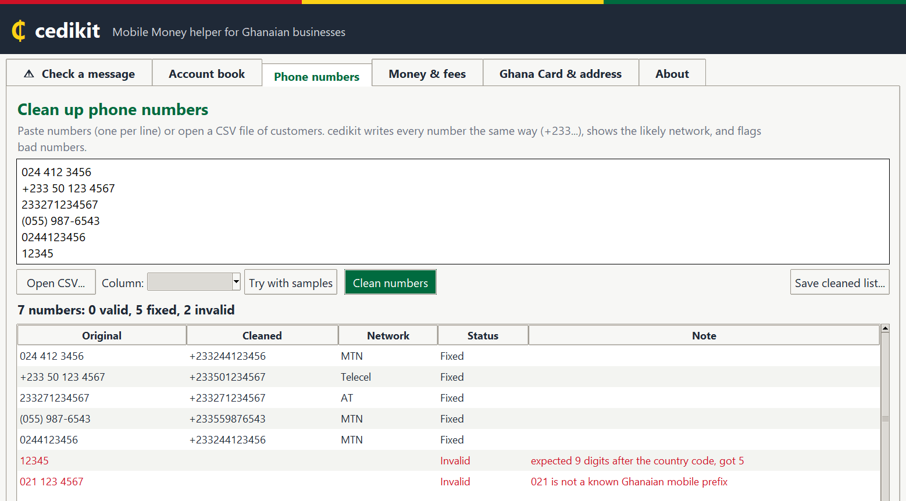

From the command line: `cedikit phone clean customers.csv --column phone`


### 💰 Amounts in words and MoMo charges

**Try this**

1. Open **Money & fees**, type `1250.50` and click **Show**.
2. Under *Estimate MoMo charges*, keep **MTN**, **Cash out (withdraw)**, `500`, and click **Estimate**.

**You'll see:** **GH₵ 1,250.50** and *One thousand two hundred and fifty Ghana cedis and fifty pesewas*; then a fee of **GH₵ 5.00**, E-Levy **GH₵ 0.00**, and where those numbers come from.

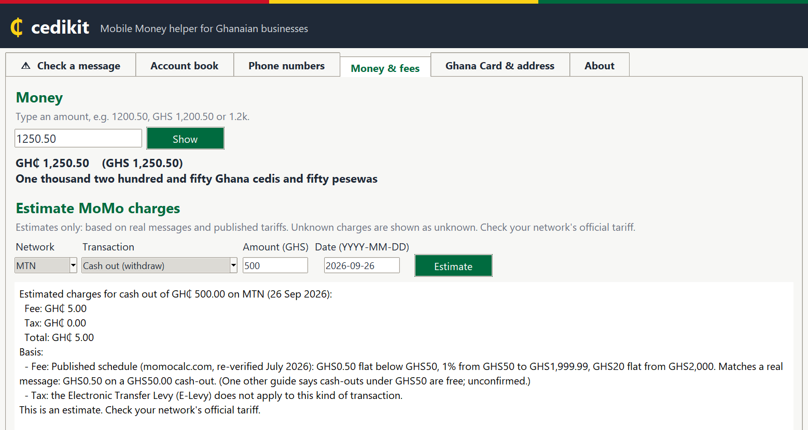

From the command line: `cedikit money words 1250.50  ·  cedikit fees estimate MTN cash_out 500`


### 🪪 Check a Ghana Card number

**Try this**

1. Open **Ghana Card & address**, type `gha 123456789 0` (any spacing or case) and click **Check**.

**You'll see:** ✔ **GHA-123456789-0 is correctly written (citizen card)**, plus a masked copy for sharing: `GHA-12*****89-0`.

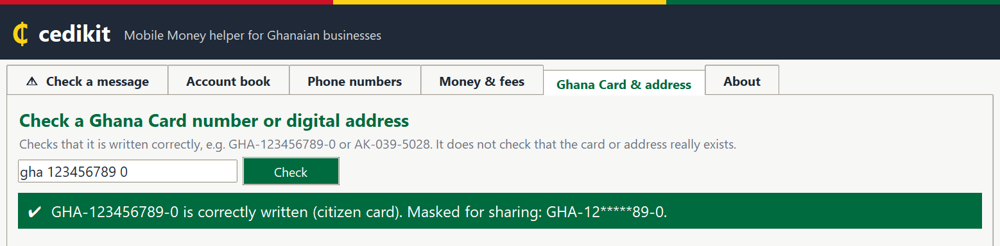

From the command line: `cedikit ids check "gha 123456789 0"`


### 🌍 Check a foreign national's Ghana Card

**Try this**

1. Type `FGN-987654321-5` and click **Check**.

**You'll see:** ✔ **FGN-987654321-5 is correctly written (foreign national card)**. Cards for non-citizens start with `FGN`.

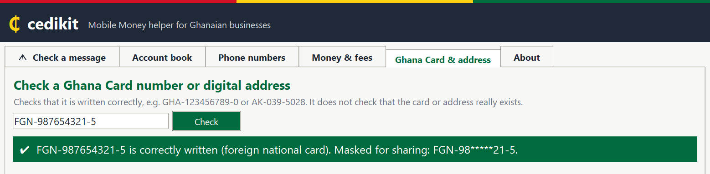

From the command line: `cedikit ids check FGN-987654321-5`


### 📍 Check a GhanaPostGPS digital address

**Try this**

1. Type `ak0395028` and click **Check**.

**You'll see:** ✔ **AK-039-5028 is correctly written: Kumasi Metropolitan, Ashanti**, with the hyphens added and the district and region looked up.

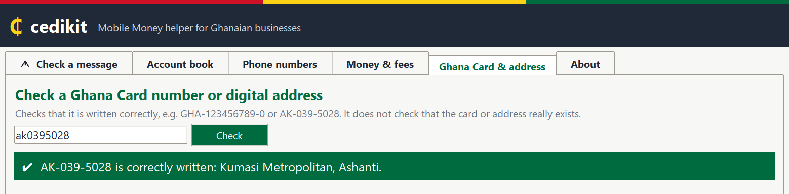

From the command line: `cedikit ids check ak0395028`


### ❌ See what a wrong ID looks like

**Try this**

1. Type `GHA-12345-6` (too few digits) and click **Check**.

**You'll see:** ✖ **Not a correctly written Ghana Card number or GhanaPostGPS address**, with examples of the right format. (These are format checks only: they never confirm that a card or address really exists.)

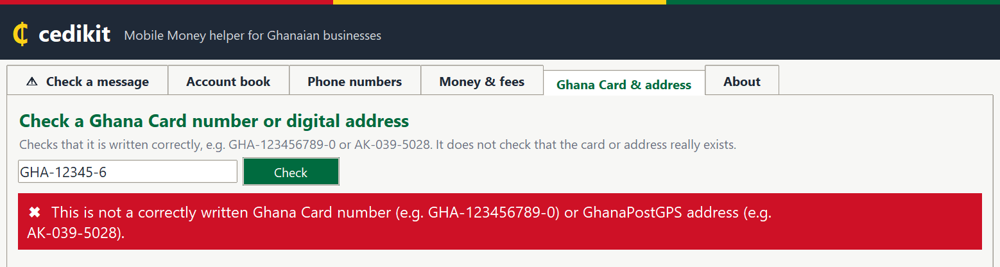

From the command line: `cedikit ids check GHA-12345-6`


## 🪟 Desktop app

A normal Windows program. Pick one way to start it:

| How | Steps |
|---|---|
| **Stand-alone program** (no Python needed) | Download `cedikit-app.exe` from the [Releases page](https://github.com/brainiacweb-tech/cedikit/releases) and double-click it |
| **With Python** | `pip install "cedikit[app]"`, then run `cedikit app` (or `cedikit-app`) |

!!! note "Windows SmartScreen"
    Windows may warn about a program "from an unknown publisher" the first time, because the
    `.exe` isn't code-signed. Click **More info → Run anyway**, but only for a file you
    downloaded from the official Releases page.

## 🌐 Web app

The same tabs in your web browser:

```bash
pip install "cedikit[web]"
cedikit web                  # opens http://localhost:8501
```

It runs **only on your own computer** (`localhost`). The launcher also switches off Streamlit's
anonymous usage statistics, so nothing is sent online.

## 🧑‍💻 How the apps are built

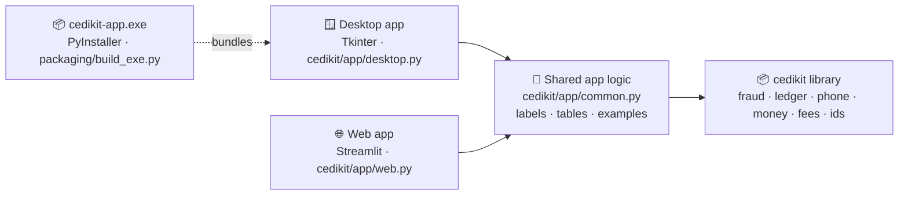

Both apps only handle screens and buttons. All the logic lives in the library and in
`cedikit/app/common.py`, which is why they always agree. The `.exe` bundles Python, the desktop
app and cedikit's data files into one 14 MB program; build it with
`python packaging/build_exe.py`, which also self-tests the result.
