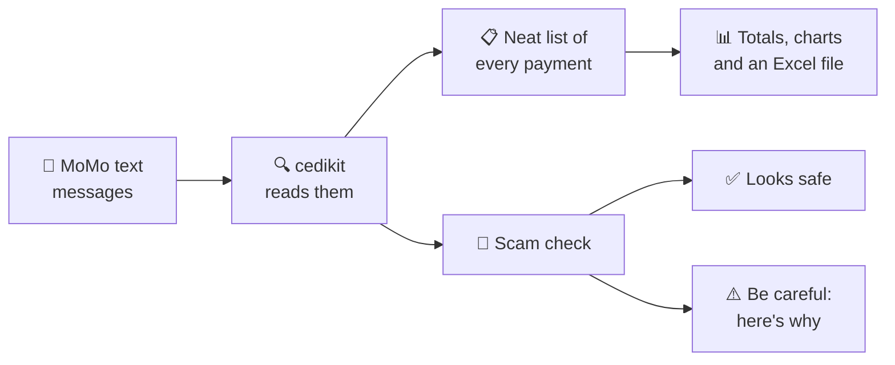

# 🧒 cedikit in plain words

*No computer knowledge needed for this part.*

## 🛒 Meet Auntie Akosua

Auntie Akosua sells provisions in Kumasi. Most of her customers pay with **Mobile Money
(MoMo)**. Every time someone pays, her phone gets a text message like this:

> *Payment received for GHS 50.00 from KOFI MENSAH. Current Balance: GHS 320.00 ...*

By the end of the month she has **hundreds** of these messages, and four problems:

1. 😵 **She can't see the big picture.** How much did she make this week? Who are her best
   customers? The answers are buried in hundreds of texts.
2. 📓 **Her records are messy.** Customers' phone numbers are written in many different ways
   (`024 412 3456`, `+233244123456`, `244123456`…), so the same person looks like three people.
3. 🧮 **Small mistakes add up.** Computers are surprisingly bad at adding money with pesewas:
   ask one to add GHS 0.10 and GHS 0.20 and you can get GHS 0.30000000000000004. Over thousands
   of sales, the totals drift.
4. 🦹 **Tricksters send fake messages.** A thief shows her a text that *looks* like a real
   payment, takes the goods, and walks away. She was never paid.

**cedikit is a set of careful helpers that fixes all four.**

## 🧰 The helpers inside cedikit

| Helper | It works like… | What it does for Auntie Akosua |
|---|---|---|
| 📱 **Number tidier** | a teacher who makes everyone write their name the same way | Rewrites every phone number in one standard form, and says which network it most likely belongs to (MTN, Telecel or AT) |
| 💰 **Money counter** | a shopkeeper who never loses a single pesewa | Adds, rounds and writes money exactly, even in words: *"Forty-five Ghana cedis and fifty pesewas"* |
| 📩 **Message reader** | a secretary who reads every MoMo text for you | Picks out who paid, how much, when, the fee and the new balance, and writes it down neatly |
| 📷 **Screenshot reader** | someone reading a letter out loud to you | Reads the message straight off a **screenshot**, so you don't have to type or copy anything |
| 📒 **Account book** | an accountant | Adds everything up: money in, money out, fees, best customers, weekly totals. Then makes an **Excel file** and **charts** |
| 🚨 **Scam detector** | a wise security guard | Looks at a payment message and says **"looks safe" ✅** or **"be careful" ⚠️**, and explains *why* |
| 🧾 **Fee calculator** | a friend who knows the price list | Estimates how much the network will charge for sending or withdrawing money |
| 🪪 **ID checker** | someone checking a form is filled in correctly | Checks that a Ghana Card number or GhanaPost digital address is *written* correctly |

## 🔄 What happens, step by step

1. **You give cedikit the messages**: copy them from the phone, **take a screenshot**, or an
   app does it for you.
2. **It reads each one** and turns it into a neat line: *"50 cedis, from Kofi Mensah,
   Monday 10:15am, balance 320 cedis."*
3. **It adds everything up** into a monthly summary, just like an accountant's report.
4. **It checks suspicious messages** for signs of a trick.

## 🕵️ How the scam detector thinks

It works like a detective looking for **clues**. One clue might be an accident; several clues
together mean real danger.

| 🔎 Clue | Why it matters |
|---|---|
| **Who sent it?** | Real MoMo alerts come from **"MobileMoney"** or **"T-CASH"**. A message from an ordinary phone number like `055 123 4567` is almost always fake. |
| **Does it look exactly like a real alert?** | Fakes copy the wording but get it slightly wrong, e.g. *"Cash In for"* instead of *"Cash In received for"*. |
| **Spelling mistakes?** | Real alerts are written by a computer and never have typos. *"Avaliable balan"* is a giveaway. |
| **Scary or pushy words?** | *"Your account is blocked, don't try your PIN"* or *"I sent it by mistake, send it back"* are classic tricks. |
| **Disguised letters?** | Tricksters write *"Suspéndéd"* with strange accents to sneak past phone spam filters. |
| **Does the maths work?** | If yesterday's balance was 100 cedis and you "received" 50, today's balance must be 150. If the message says 700, something is wrong. |

The more clues it finds, the louder the alarm: **LOW** 🟢, **MEDIUM** 🟡 or **HIGH** 🔴.
It always explains which clues it found.

!!! warning "cedikit is a helper, not a bank"
    Even when it says "looks safe", always check your balance in the official MoMo app or by
    dialling your network's official code **before handing over goods**.

## 🔒 Is my information safe?

Yes. cedikit works **entirely on your own computer or phone app**. It never sends your messages,
numbers or money details anywhere on the internet.

## 👥 Who is it for?

- 🏪 **Shop owners** can use the **desktop app** directly: no coding, just buttons
  ([see the apps page](apps.md)).
- 👩‍💻 **Programmers** use it like **ready-made building blocks** to build apps for Ghanaian
  businesses, so they don't have to build these helpers from scratch.
- 🏪 **Traders** also benefit through apps other people build on cedikit: cleaner records,
  automatic accounts and scam warnings.
- 🎓 **Students and researchers** use it to study Mobile Money data.

## 📚 Words you might see

| Word | Meaning |
|---|---|
| **Mobile Money (MoMo)** | Sending and receiving money using a phone, e.g. MTN MoMo or Telecel Cash |
| **SMS** | A text message |
| **Library** | A box of ready-made tools that programmers put inside their own apps |
| **Python** | A popular programming language; cedikit is written in it |
| **Open source** | The code is free for anyone to see, use and improve |
| **PyPI** | The online "app store" for Python tools; cedikit lives there |
| **Offline** | Works without the internet |
